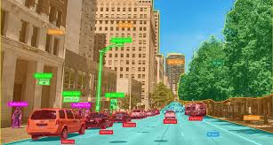
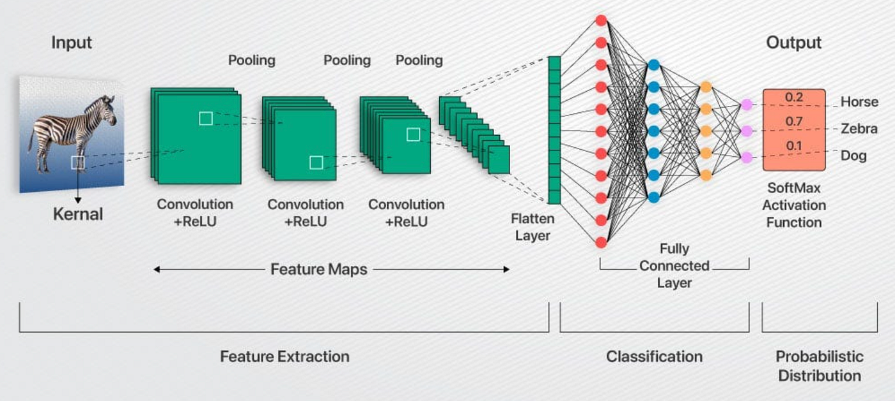
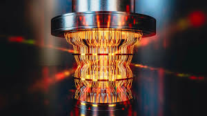
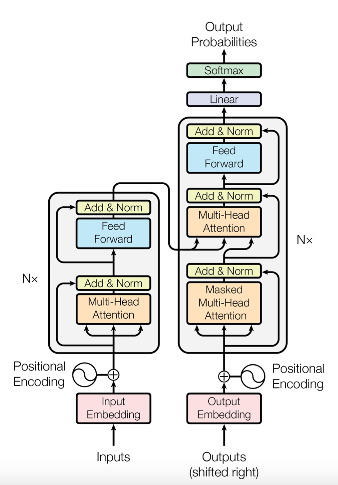

  
  

  
  

🚀 ICT Engineering Student @ SUP'COM | Passionate about AI, Machine Learning, Deep Learning & Generative AI

Hey there! I'm an ICT engineering student at SUP'COM with a strong focus on Artificial Intelligence, Machine Learning, and Deep Learning. I have deep knowledge of Large Language Models (LLMs) and Generative AI, exploring their transformative potential in various applications. Currently, I'm diving deep into Reinforcement Learning (RL) and working on a hands-on project in this exciting field. My interests also extend to Computer Vision and Deep RL, where I love turning complex problems into creative solutions.

Beyond AI, I have a solid foundation in embedded systems—blending hardware and software for smarter tech.

🎨 Fun Fact: When I'm not coding, you'll find me expressing my creativity as a part-time graphic designer, video editor, brand strategist, and photographer.

Catchphrase:
"Coding the future, framing the present."

Stay tuned for my project links & portfolio—coming soon!
